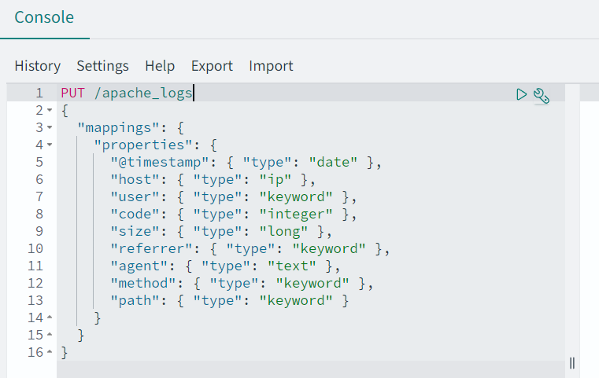
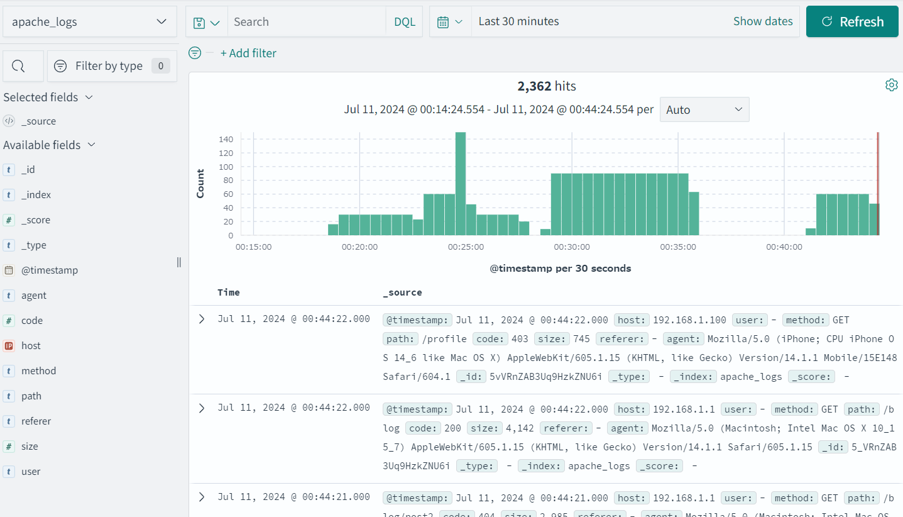
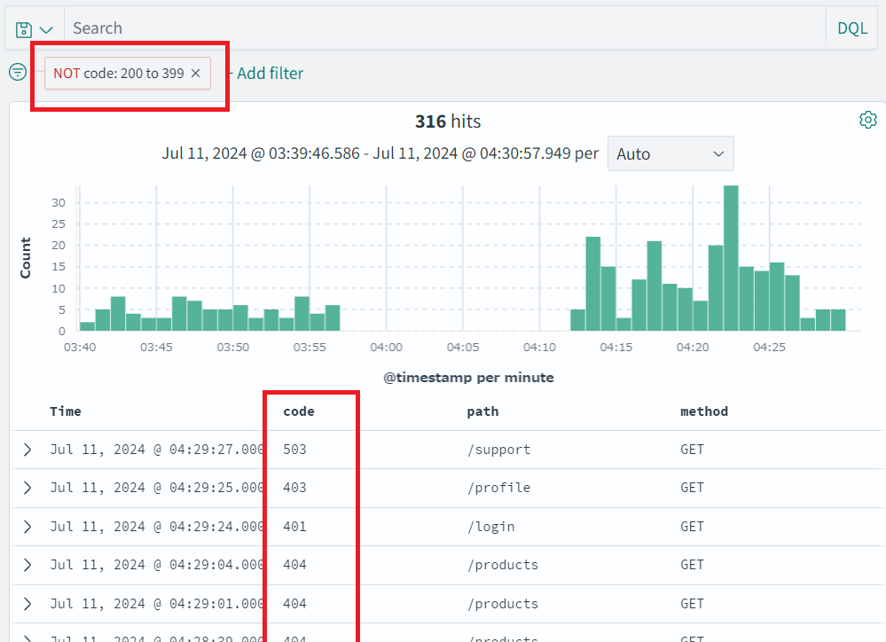
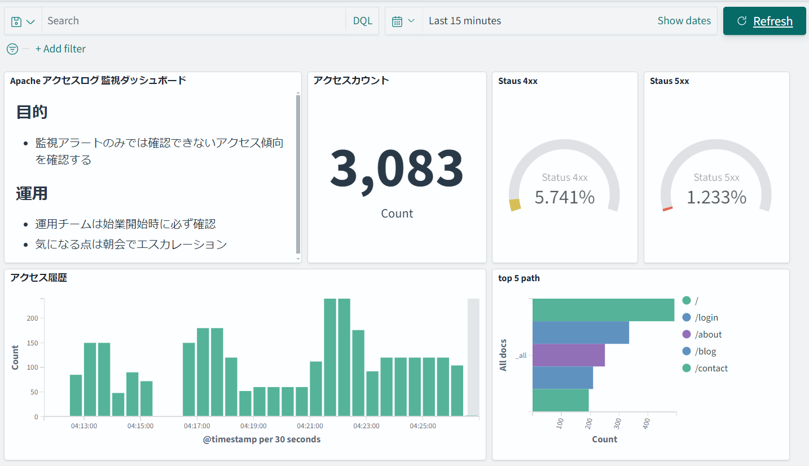

# apache logs generator

apache のダミーログ（アクセスログ）を出力・転送・分析するレポジトリ。

## 関連ドキュメント

- [OpenSearch Service でログ分析入門！](https://zenn.dev/teradatky/articles/opensearch-log-analysis-20240712)
- [Apache のダミーログを作る！](https://zenn.dev/teradatky/articles/generate-apache-dummy-log-20240711)
- [ElasticSearch/Kibanaのトラブルシュート＆Tips](https://zenn.dev/teradatky/articles/elasticsearch-tips-20240711)

## ログ生成

```bash
# 引数は1秒あたりに出力する行数
go run main.go 1

# 出力例
192.168.0.10 - - [15/Jul/2024:22:35:20 +0900] "GET /support HTTP/1.1" 200 1807 "-" "Mozilla/5.0 (Macintosh; Intel Mac OS X 10_15_7) AppleWebKit/605.1.15 (KHTML, like Gecko) Version/14.1.1 Safari/605.1.15"
192.168.1.100 - - [15/Jul/2024:22:35:21 +0900] "GET /support HTTP/1.1" 200 3282 "-" "Mozilla/5.0 (X11; Linux x86_64; rv:89.0) Gecko/20100101 Firefox/89.0"
10.0.0.1 - - [15/Jul/2024:22:35:22 +0900] "GET /blog/post2 HTTP/1.1" 404 4587 "-" "Mozilla/5.0 (Windows NT 10.0; Win64; x64) AppleWebKit/537.36 (KHTML, like Gecko) Chrome/92.0.4515.107 Safari/537.36"

# Ctrl+Cで停止
^Csignal: interrupt
```

## ログ転送

```bash
# fluent-bit をインストール
curl https://raw.githubusercontent.com/fluent/fluent-bit/master/install.sh | sh
# 設定を編集
sudo vi /etc/fluent-bit/fluent-bit.conf
# fluent-bit を再起動
sudo systemctl restart fluent-bit
# サービスの状態が acvtive (running) か確認
sudo systemctl status fluent-bit
# エラーが出ていないかログを確認
journalctl -u fluent-bit -e
```

```bash
# 出力用のディレクトリ準備
sudo mkdir /var/log/apache2_test
sudo chmod 777 /var/log/apache2_test
# ダミーログ出力プログラムを作成
vi main.go
# Apache のダミーログを出力（引数は 1 秒あたりの出力行数）
go run main.go 5 >> /var/log/apache2_test/access.log
```

## ログ分析

データ投入前に Kibana の Dev Tools から mappings を投入すること。



Kibana での分析画面の例。




